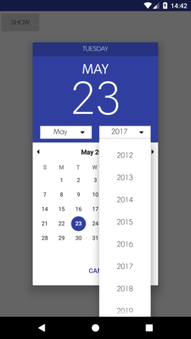
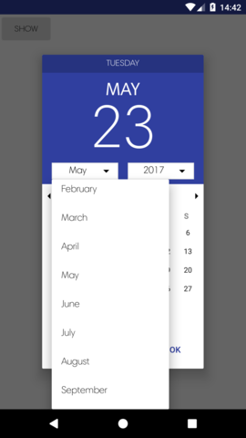

# AlmostMaterialDatepicker

Date picker made in material design style with some additional spinner for more convenient use.

  

# Install
To add this library to your project, you must add the JitPack repo to your root build.gradle file...

```groovy
allprojects {
 repositories {
    ...
    maven { url "https://jitpack.io" }
 }
}
```

Then include this line in your dependencies block...

```
compile 'com.shagi:material-datepicker:1.0'
```

# Usage

```kotlin
   val dialog = DatePickerFragmentDialog.newInstance({ view, year, monthOfYear, dayOfMonth ->
                Toast.makeText(applicationContext,
                        "year $year month $monthOfYear day $dayOfMonth",
                        Toast.LENGTH_SHORT).show()
            }, 2017, 11, 4)

            dialog.show(supportFragmentManager, "tag")

            /* Possible params
                dialog.setMaxDate(System.currentTimeMillis())
                dialog.setMinDate(System.currentTimeMillis())
                dialog.setYearRange(2000, 2010)
                dialog.setCancelColor(Color.MAGENTA)
                dialog.setOkColor(Color.MAGENTA)
                dialog.setAccentColor(Color.MAGENTA)
                dialog.setCancelText("Out")
                dialog.setOkText("Fine")
            */
```
